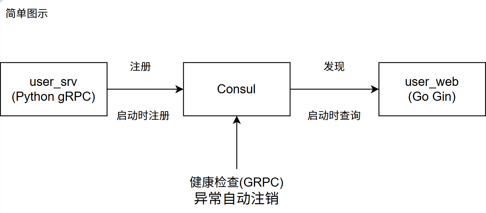

# AtopMall 电商微服务项目

基于 Go + Python 双语言混合开发的电商微服务项目。微服务层使用 Python + gRPC 实现业务逻辑，Web API 层使用 Go + Gin 对外提供 HTTP 接口，通过 gRPC 进行服务间通信，使用 Consul 实现服务注册与发现，使用 Nacos 作为配置中心统一管理配置。

## 一、项目结构

项目采用分层架构，主要分为两大模块：

| 模块             | 技术栈        | 职责                                       |
| ---------------- | ------------- | ------------------------------------------ |
| `atopmall_srvs/` | Python + gRPC | 微服务层，实现业务逻辑（用户、商品等服务） |
| `atopmall_web/`  | Go + Gin      | Web API 层，对外提供 HTTP 接口             |

每个微服务目录结构统一：`handler/`（业务逻辑）、`model/`（数据模型）、`proto/`（Protobuf）、`settings/`（配置）、`server.py`（服务入口）

详细目录结构和文件说明请参见 [项目结构文档](docs/project-structure.md)

## 二、技术栈总览

| 分类         | 技术选型                | 说明                                       |
| ------------ | ----------------------- | ------------------------------------------ |
| 开发语言     | Go 1.22+ / Python 3.13+ | Go 负责 Web API 层，Python 负责微服务层    |
| 微服务通信   | gRPC + Protobuf         | 服务间远程调用                             |
| 服务注册发现 | Consul                  | 微服务注册与健康检查                       |
| 配置中心     | Nacos                   | 统一配置管理，支持配置变更实时推送         |
| Web 框架     | Gin                     | Go HTTP 接口层开发                         |
| Python ORM   | Peewee                  | Python 数据库操作（含连接池 + 断线重连）   |
| Go ORM       | GORM（待集成）          | Go 数据库操作                              |
| Python 日志  | Loguru                  | Python 端日志组件                          |
| Go 日志      | Zap                     | Go 端高性能结构化日志                      |
| 配置管理     | Viper                   | YAML 配置文件加载与管理（本地 Nacos 连接） |
| 数据库       | MySQL                   | 数据存储                                   |
| 缓存         | Redis                   | 验证码存储、会话管理                       |
| JWT 认证     | golang-jwt/v5           | Token 生成与验证                           |
| 图片验证码   | base64Captcha           | 登录防暴力破解                             |
| 邮件服务     | jordan-wright/email     | SMTP 邮箱验证码发送                        |
| 表单验证     | go-playground/validator | 请求参数校验                               |

## 三、已完成功能

| 服务          | 语言        | 核心能力                                              |
| ------------- | ----------- | ----------------------------------------------------- |
| 用户微服务    | Python gRPC | 用户 CRUD、密码校验、服务注册发现、Nacos 配置管理     |
| 商品微服务    | Python gRPC | 商品/分类/品牌/轮播图/品牌分类管理（23 个 gRPC 接口） |
| 用户 Web 服务 | Go Gin      | 图片验证码、邮箱验证码、登录注册、JWT 认证            |

**通用能力**：Consul 服务注册、gRPC 健康检查、优雅退出、Nacos 配置热更新、动态端口分配、逻辑删除

详细功能清单和接口说明请参见 [已完成功能文档](docs/features.md)

## 四、API 路由结构

```
/u/v1/
├── base/                          # 基础服务（无需登录）
│   ├── GET  captcha               # 获取图片验证码
│   └── POST send-code             # 发送邮箱验证码
│
└── user/                          # 用户服务
    ├── POST pwd_login             # 密码登录（无需登录）
    ├── POST register              # 用户注册（无需登录）
    └── GET  list                  # 用户列表（需 JWT + 管理员）
```

## 五、开发工具清单

| 工具                                 | 用途                                   |
| ------------------------------------ | -------------------------------------- |
| `protoc` + 插件                      | Protocol Buffers 代码生成（Go/Python） |
| `air`                                | Go 代码热重载                          |
| `grpcio-tools`                       | Python gRPC 代码生成                   |
| `python-consul` / `nacos-sdk-python` | 服务注册与配置中心客户端               |

**Proto 生成命令**（在 proto 文件所在目录下执行）：

```bash
# Go 端
protoc --go_out=. --go_opt=paths=source_relative --go-grpc_out=. --go-grpc_opt=paths=source_relative xxx.proto

# Python 端
python -m grpc_tools.protoc -I. --python_out=. --grpc_python_out=. xxx.proto
```

详细工具清单和安装方式请参见 [开发工具文档](docs/dev-tools.md)

## 六、快速开始

### 1. 环境准备

1. 安装 Go 1.22+ 并配置 GOPATH 环境变量
2. 安装 Python 3.10+ 并创建虚拟环境
3. 安装上表中所有开发工具
4. 本地启动 MySQL 数据库或者虚拟机安装 Docker 拉取 MySQL 镜像使用
5. 本地启动 Redis 服务
6. 本地启动 Consul 服务（服务注册与发现）
7. Docker 启动 Nacos 服务（配置中心），并在 Nacos 中创建对应的配置

> 没有开发经验的可以参考我的有道云笔记:
> 【有道云笔记】项目前期准备
> https://share.note.youdao.com/s/QJFUWhau

### 2. Nacos 配置中心准备

在 Nacos 控制台中创建以下配置：

| 服务      | Data ID        | Group | 配置内容                              |
| --------- | -------------- | ----- | ------------------------------------- |
| user_srv  | user-srv.json  | dev   | MySQL、Consul、服务名称等配置         |
| user_web  | user-web.json  | dev   | MySQL、Redis、Consul、JWT、邮箱等配置 |
| goods_srv | goods-srv.json | dev   | MySQL、Consul、服务名称等配置         |

> user_web 的 nacos 配置可参考 `config-debug_templ.yaml` 文件

### 3. 启动用户微服务（Python gRPC）

```bash
cd atopmall_srvs/user_srv
pip install -r requirements.txt
python -m server
```

> 默认监听端口：50051，启动后自动注册到 Consul，配置从 Nacos 拉取

### 4. 启动商品微服务（Python gRPC）

```bash
cd atopmall_srvs/goods_srv
pip install -r requirements.txt
python -m server
```

> 默认使用动态端口，启动后自动注册到 Consul，配置从 Nacos 拉取

### 5. 启动用户 Web 服务（Go Gin）

```bash
cd atopmall_web/user_web
# 复制配置模板并修改（仅需配置 Nacos 连接信息）
cp config-debug_templ.yaml config-debug.yaml
go mod tidy
go run main.go
```

> 默认监听端口：8081，启动后从 Nacos 拉取业务配置，从 Consul 发现用户服务地址

## 七、配置说明

项目使用 **Viper** 管理本地配置，业务配置统一存放在 **Nacos 配置中心**。

**配置加载流程**：

```
启动 → Viper 读取本地 config-debug.yaml（Nacos 连接信息）
     → 连接 Nacos → 拉取业务配置（MySQL、Redis、Consul 等）
     → 解析到全局变量 → 注册配置变更监听（实时生效）
```

| 本地配置文件              | 用途                         |
| ------------------------- | ---------------------------- |
| `config-debug_templ.yaml` | Nacos 配置模板（可提交 Git） |
| `config-debug.yaml`       | Nacos 连接调试配置           |
| `config-pro.yaml`         | Nacos 连接生产配置           |

详细配置说明请参见 [配置说明文档](docs/configuration.md)

## 八、服务注册与发现流程



1. **user_srv / goods_srv** 启动时通过 `python-consul` 注册到 Consul，包含 GRPC 健康检查
2. **user_web** 启动时从 Consul 查询服务的地址和端口
3. **user_web** 建立 gRPC 长连接（支持负载均衡策略），后续请求复用该连接
4. 微服务异常退出时，Consul 自动注销该服务实例

## 九、用户注册流程

```
前端 → 获取图片验证码 → 填写注册信息（手机号、密码、邮箱）
     → 请求发送邮箱验证码 → 后端生成验证码存入 Redis（5分钟有效期）
     → 用户收到邮件，填写验证码 → 提交注册
     → 后端校验：手机号是否已存在 → 邮箱验证码是否正确
     → 调用 gRPC CreateUser 创建用户 → 生成 JWT Token 返回
```

## 十、配置中心架构图

```
┌──────────────────────────────────────────────────────────────────┐
│                        Nacos 配置中心                              │
│  ─────────────────┐  ┌─────────────────┐  ┌─────────────────┐  │
│  │  user-srv.json   │  │  user-web.json   │  │  goods-srv.json  │  │
│  │  (Python 配置)   │  │  (Go 配置)       │  │  (Python 配置)   │  │
│  │  - MySQL         │  │  - MySQL         │  │  - MySQL         │  │
│  │  - Consul        │  │  - Redis         │  │  - Consul        │  │
│  │  - 服务名称       │  │  - Consul        │  │  - 服务名称       │  │
│  │                  │  │  - JWT           │  │                  │  │
│  │                  │  │  - 邮箱 SMTP     │  │                  │  │
│  └────────┬────────  └────────────────  └────────┬────────  │  │
│           │ 配置推送            │ 配置推送            │ 配置推送    │  │
└───────────┼────────────────────┼────────────────────┼──────────┘  │
            │                    │                    │              │
            ▼                    ▼                    ▼              │
┌───────────────────┐  ────────────────────┐  ┌────────────────  │
│    user_srv       │  │    user_web         │  │   goods_srv    │  │
│  (Python gRPC)    │  │    (Go Gin)         │  │  (Python gRPC) │  │
│                   │  │                     │  │                │  │
│  settings.py      │  │  initialize/        │  │  settings.py   │  │
│  ↓ Nacos 拉取配置  │  │  config.go          │  │  ↓ Nacos 拉取  │  │
│  ↓ 配置变更监听    │  │  ↓ Nacos 拉取配置    │  │  ↓ 配置变更监听 │  │
│  ↓ 初始化 DB      │  │  ↓ 配置变更监听      │  │  ↓ 初始化 DB   │  │
│                   │  │  ↓ 初始化各组件      │  │                │  │
│  Consul 注册      │  │  Consul 发现        │  │  Consul 注册   │  │
│  ↓ 注册服务       │  │  ↓ 获取服务地址      │  │  ↓ 注册服务    │  │
│  ↓ 健康检查       │  │  ↓ gRPC 长连接      │  │  ↓ 健康检查    │  │
│  ↓ 优雅退出       │  │  ↓ 负载均衡         │  │  ↓ 优雅退出    │  │
└───────────────────┘  └────────────────────┘  └────────────────┘  │
```

## 十一、各服务 README

> 每个微服务将拥有独立的 README 文档，开发中...

| 服务                     | 语言   | 状态   |
| ------------------------ | ------ | ------ |
| user_srv（用户微服务）   | Python | 开发中 |
| goods_srv（商品微服务）  | Python | 开发中 |
| user_web（用户 Web API） | Go     | 开发中 |
