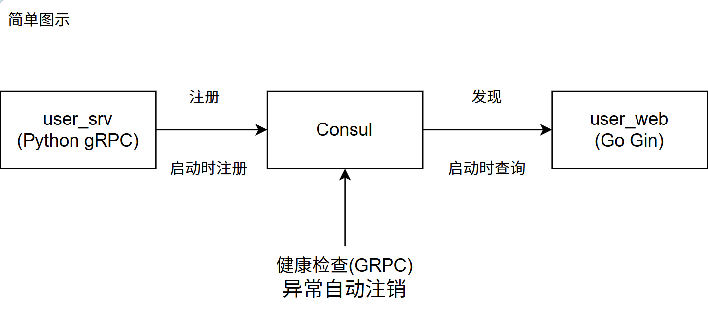

# AtopMall 电商微服务项目

基于 Go + Python 双语言混合开发的电商微服务项目。微服务层使用 Python + gRPC 实现业务逻辑，Web API 层使用 Go + Gin 对外提供 HTTP 接口，通过 gRPC 进行服务间通信，使用 Consul 实现服务注册与发现，使用 Nacos 作为配置中心，使用 RocketMQ 实现分布式事务与异步解耦，使用 OpenTelemetry + Jaeger 实现全链路追踪。

## 一、项目结构

项目采用分层架构，主要分为两大模块：

| 模块             | 技术栈        | 职责                                         |
| ---------------- | ------------- | -------------------------------------------- |
| `atopmall_srvs/` | Python + gRPC | 微服务层（用户、商品、订单、库存、用户操作） |
| `atopmall_web/`  | Go + Gin      | Web API 层，对外提供 HTTP 接口               |
| └ `user_web/`    | Go + Gin      | 用户 Web 服务（登录/注册/验证码）            |
| └ `goods_web/`   | Go + Gin      | 商品 Web 服务（商品/分类/品牌/轮播图）       |
| └ `order_web/`   | Go + Gin      | 订单 Web 服务（订单/购物车）                 |
| └ `userop_web/`  | Go + Gin      | 用户操作 Web 服务（留言/收藏/地址）          |
| └ `oss_web/`     | Go + Gin      | 文件存储服务（MinIO 预签名直传）             |

每个微服务目录结构统一：`handler/`（业务逻辑）、`model/`（数据模型）、`proto/`（Protobuf）、`settings/`（配置）、`server.py`（服务入口）

详细目录结构和文件说明请参见 [项目结构文档](docs/project-structure.md)

## 二、技术栈总览

| 分类         | 技术选型                  | 说明                                              |
| ------------ | ------------------------- | ------------------------------------------------- |
| 开发语言     | Go 1.22+ / Python 3.13+   | Go 负责 Web API 层，Python 负责微服务层           |
| 微服务通信   | gRPC + Protobuf           | 服务间远程调用                                    |
| API 网关     | Kong                      | 统一入口、路由分发、JWT 认证                      |
| 服务注册发现 | Consul                    | 微服务注册与健康检查                              |
| 配置中心     | Nacos                     | 统一配置管理，支持配置变更实时推送                |
| Web 框架     | Gin                       | Go HTTP 接口层开发                                |
| Python ORM   | Peewee                    | Python 数据库操作（含连接池 + 断线重连）          |
| Go ORM       | GORM（待集成）            | Go 数据库操作                                     |
| Python 日志  | Loguru                    | Python 端日志组件                                 |
| Go 日志      | Zap                       | Go 端高性能结构化日志                             |
| 配置管理     | Viper                     | YAML 配置文件加载与管理（本地 Nacos 连接）        |
| 数据库       | MySQL                     | 数据存储                                          |
| 缓存         | Redis                     | 验证码存储、会话管理、分布式锁                    |
| 分布式锁     | Redis + python-redis-lock | 防止超卖等并发问题                                |
| 乐观锁       | MySQL version 字段        | 库存扣减并发控制                                  |
| 消息队列     | RocketMQ                  | 事务消息、延时消息、库存归还异步解耦              |
| 支付         | 支付宝 v3                 | 网页支付、支付回调、订单状态同步                  |
| JWT 认证     | golang-jwt/v5             | Token 生成与验证，兼容 Kong 前缀                  |
| 限流熔断     | Sentinel (Go)             | 接口级限流（53 条规则）+ 熔断降级（53 条规则）    |
| 图片验证码   | base64Captcha             | 登录防暴力破解                                    |
| 邮件服务     | jordan-wright/email       | SMTP 邮箱验证码发送                               |
| 表单验证     | go-playground/validator   | 请求参数校验                                      |
| 对象存储     | MinIO                     | 文件存储（预签名 PUT 直传、孤儿文件清理）         |
| 链路追踪     | OpenTelemetry + Jaeger    | 全链路追踪（Go Gin + Python gRPC），OTLP 协议上报 |

## 三、已完成功能

| 服务              | 语言        | 核心能力                                                    |
| ----------------- | ----------- | ----------------------------------------------------------- |
| 用户微服务        | Python gRPC | 用户 CRUD、密码校验、Nacos 配置管理                         |
| 商品微服务        | Python gRPC | 商品/分类/品牌/轮播图/品牌分类管理（23 个 gRPC 接口）       |
| 订单微服务        | Python gRPC | 购物车 CRUD、订单创建/查询、RocketMQ 事务消息、超时自动取消 |
| 库存微服务        | Python gRPC | 库存设置/查询/扣减/归还、Redis 分布式锁、RocketMQ 异步归还  |
| 用户操作微服务    | Python gRPC | 留言管理、用户收藏、收货地址 CRUD                           |
| 用户 Web 服务     | Go Gin      | 图片验证码、邮箱验证码、登录注册、JWT 认证                  |
| 商品 Web 服务     | Go Gin      | 商品列表查询（多条件过滤）、gRPC 负载均衡连接               |
| 订单 Web 服务     | Go Gin      | 订单创建/查询、购物车管理、支付宝支付、JWT 认证             |
| 用户操作 Web 服务 | Go Gin      | 留言、收藏、地址管理、JWT 认证                              |
| 文件存储服务      | Go Gin      | MinIO 预签名直传、拖拽上传、孤儿文件清理                    |

**通用能力**：Consul 服务注册、gRPC 健康检查、优雅退出、Nacos 配置热更新、动态端口分配、逻辑删除、OpenTelemetry 全链路追踪、Sentinel 限流熔断（53 条规则）

详细功能清单和接口说明请参见 [已完成功能文档](docs/features.md)

## 四、API 路由结构

```
/u/v1/                             # 用户服务（端口 8081）
├── base/                          # 基础服务（无需登录）
│   ├── GET  captcha               # 获取图片验证码
│   └── POST send-code             # 发送邮箱验证码
└── user/                          # 用户服务
    ├── POST pwd_login             # 密码登录
    ├── POST register              # 用户注册
    └── GET  list                  # 用户列表（需 JWT + 管理员）

/g/v1/                             # 商品服务（端口 8082）
├── goods/                         # 商品（列表/详情/CRUD/库存/状态更新）
├── categorys/                     # 分类（列表/详情/CRUD）
├── brands/                        # 品牌（列表/CRUD）
├── banners/                       # 轮播图（列表/CRUD）
└── categorybrands/                # 品牌分类（列表/按分类查/CRUD）

/oss/v1/                           # 文件存储服务（端口 8083）
└── oss/
    ├── GET  token                 # 获取 MinIO 预签名上传 URL
    └── DELETE cleanup             # 清理孤儿文件

/o/v1/                             # 订单服务（端口 8084）
├── order/                         # 订单（列表/创建/详情）
├── shoppingcart/                  # 购物车（列表/添加/删除/更新）
└── pay/                           # 支付（支付宝）
    ├── GET  alipay/notify         # 支付宝异步回调通知
    └── GET  alipay/return         # 支付宝同步回调通知

/op/v1/                            # 用户操作服务（端口 8085）
├── message/                       # 留言（列表/创建）
├── userfavs/                      # 收藏（列表/详情/添加/删除）
└── address/                       # 地址（列表/创建/删除/更新）

> 路由统一为 `/v1`，Kong API 网关通过 Path 前缀（`/g`、`/u`、`/o`、`/op`、`/oss`）区分服务并 `strip_path=true` 剥离前缀转发

## 五、Sentinel 限流熔断

所有 Web 服务已集成 Sentinel 限流与熔断保护，使用共享资源名策略：限流规则和熔断规则共用同一资源名，一个 `sentinel.Entry()` 调用同时检查两者。

### 限流策略

| 服务       | 规则数 | 阈值说明                                                           |
| ---------- | ------ | ------------------------------------------------------------------ |
| goods_web  | 25 条  | 商品/分类/品牌/轮播图/分类品牌 CRUD，查询类 10次/6s，操作类 3次/6s |
| order_web  | 8 条   | 订单/购物车/支付回调，查询类 10次/6s，操作类 3-5次/6s              |
| user_web   | 7 条   | 用户列表/登录/注册/详情/更新/验证码，验证码 1次/60s                |
| userop_web | 10 条  | 地址/收藏/留言 CRUD，查询类 10次/6s，操作类 3-5次/6s               |
| oss_web    | 3 条   | 上传 Token 5次/6s，清理 1次/60s                                    |

### 熔断策略

| 参数     | 值         | 说明                    |
| -------- | ---------- | ----------------------- |
| 策略     | ErrorRatio | 错误比例触发            |
| 阈值     | 50%        | 错误率超过 50% 打开熔断 |
| 最小请求 | 5          | 统计窗口内至少 5 个请求 |
| 统计窗口 | 10s        | 滑动窗口统计            |
| 恢复时间 | 5s         | 熔断后半开试探间隔      |

**工作流程**：
```
请求 → sentinel.Entry() → 检查限流规则 → 检查熔断状态
  ↓ 通过                    ↓ 限流/熔断
gRPC 调用 → 成功: e.Exit()  返回 429 "请求频率过快"
  ↓ 失败
sentinel.TraceError(e, err) → 错误率 > 50% → 熔断打开 → 快速失败
  5s 后半开试探 → 成功则恢复，失败则继续熔断
```

**优势**：下游服务（gRPC Srv 层）故障时，Web 层不再等待超时，直接快速失败，防止连接池耗尽和雪崩效应。

## 六、开发工具清单

| 工具                                 | 用途                                   |
| ------------------------------------ | -------------------------------------- |
| `protoc` + 插件                      | Protocol Buffers 代码生成（Go/Python） |
| `air`                                | Go 代码热重载                          |
| `grpcio-tools`                       | Python gRPC 代码生成                   |
| `python-consul` / `nacos-sdk-python` | 服务注册与配置中心客户端               |
| `rocketmq-client-python`             | RocketMQ 消息队列客户端                |
| `opentelemetry-api/sdk`              | OpenTelemetry 链路追踪（Go + Python）  |
| `tmux`                               | Linux 终端复用器（一键启停脚本依赖）   |

**Proto 生成命令**（在 proto 文件所在目录下执行）：

```bash
# Go 端
protoc --go_out=. --go_opt=paths=source_relative --go-grpc_out=. --go-grpc_opt=paths=source_relative xxx.proto

# Python 端
python -m grpc_tools.protoc -I. --python_out=. --grpc_python_out=. xxx.proto
```

详细工具清单和安装方式请参见 [开发工具文档](docs/dev-tools.md)

## 七、快速开始

### 1. 环境准备

1. 安装 Go 1.22+ 并配置 GOPATH 环境变量
2. 安装 Python 3.10+ 并创建虚拟环境
3. 安装上表中所有开发工具
4. 本地启动 MySQL 数据库或者虚拟机安装 Docker 拉取 MySQL 镜像使用
5. 本地启动 Redis 服务
6. 本地启动 Consul 服务（服务注册与发现）
7. Docker 启动 Nacos 服务（配置中心），并在 Nacos 中创建对应的配置
8. 启动 RocketMQ NameServer 和 Broker（消息队列，订单和库存服务依赖）
9. 启动 Jaeger（链路追踪，可选），推荐使用 Docker 一键启动

> 没有开发经验的可以参考我的有道云笔记:
> 【有道云笔记】项目前期准备
https://share.note.youdao.com/s/RA68Zm9P

### 2. Nacos 配置中心准备

在 Nacos 控制台中创建以下配置：

| 服务          | Data ID            | Group | 配置内容                                               |
| ------------- | ------------------ | ----- | ------------------------------------------------------ |
| user_srv      | user-srv.json      | dev   | MySQL、Consul、Jaeger、服务名称等配置                  |
| user_web      | user-web.json      | dev   | MySQL、Redis、Consul、JWT、Jaeger、邮箱等配置          |
| goods_srv     | goods-srv.json     | dev   | MySQL、Consul、Jaeger、服务名称等配置                  |
| goods_web     | goods-web.json     | dev   | Consul、JWT、Jaeger、商品服务地址等配置                |
| order_srv     | order-srv.json     | dev   | MySQL、Consul、RocketMQ、Jaeger、商品/库存服务名等配置 |
| order_web     | order-web.json     | dev   | Consul、JWT、支付宝、Jaeger、订单服务地址等配置        |
| inventory_srv | inventory-srv.json | dev   | MySQL、Redis、RocketMQ、Jaeger、Consul 等配置          |
| userop_srv    | userop-srv.json    | dev   | MySQL、Consul、Jaeger、服务名称等配置                  |
| userop_web    | userop-web.json    | dev   | Consul、JWT、Jaeger、用户操作服务地址等配置            |
| oss_web       | oss-web.json       | dev   | MinIO、Consul、Jaeger 等配置                           |

> user_web / goods_web 的 nacos 配置可参考 `config-debug_templ.yaml` 文件

### 3. 启动 Jaeger（可选，用于链路追踪）

```bash
# Docker 一键启动 Jaeger（集成了 Collector + Query UI + In-Memory Storage）
docker run -d --name jaeger \
  -p 16686:16686 \
  -p 4317:4317 \
  -p 4318:4318 \
  jaegertracing/all-in-one:latest
```

> Jaeger UI 访问地址：http://localhost:16686
> OTLP gRPC 上报端口：4317
> 各服务启动后自动上报 Trace 数据到 Jaeger，在 Jaeger UI 中可查看全链路调用链

### 4. 启动用户微服务（Python gRPC）

```bash
cd atopmall_srvs/user_srv
pip install -r requirements.txt
python -m server
```

> 默认使用动态端口，启动后自动注册到 Consul，配置从 Nacos 拉取，自动初始化 Jaeger 链路追踪

### 5. 启动商品微服务（Python gRPC）

```bash
cd atopmall_srvs/goods_srv
pip install -r requirements.txt
python -m server
```

> 默认使用动态端口，启动后自动注册到 Consul，配置从 Nacos 拉取，自动初始化 Jaeger 链路追踪

### 6. 启动用户 Web 服务（Go Gin）

```bash
cd atopmall_web/user_web
# 复制配置模板并修改（仅需配置 Nacos 连接信息）
cp config-debug.yaml
go mod tidy
go run main.go
```

> 默认监听端口：18081，启动后从 Nacos 拉取业务配置，从 Consul 发现用户服务地址，自动初始化 Jaeger 链路追踪，Gin 路由挂载 otelgin 中间件

### 7. 启动商品 Web 服务（Go Gin）

```bash
cd atopmall_web/goods_web
# 复制配置模板并修改（仅需配置 Nacos 连接信息）
cp config-debug.yaml
go mod tidy
go run main.go
```

> 默认监听端口：18082，启动后从 Nacos 拉取业务配置，从 Consul 发现商品服务地址，自动注册到 Consul，自动初始化 Jaeger 链路追踪

### 8. 启动文件存储服务（Go Gin）

```bash
cd atopmall_web/oss-web
# 复制配置模板并修改（仅需配置 Nacos 连接信息）
cp config-debug.yaml
go mod tidy
go run main.go
```

> 默认监听端口：18083，启动后从 Nacos 拉取业务配置，初始化 MinIO 客户端，自动注册到 Consul，自动初始化 Jaeger 链路追踪

### 9. 启动订单微服务（Python gRPC）

```bash
cd atopmall_srvs/order_srv
pip install -r requirements.txt
python -m server
```

> 默认使用动态端口，启动后自动注册到 Consul，配置从 Nacos 拉取，需先启动 RocketMQ、商品服务和库存服务，自动初始化 Jaeger 链路追踪

### 10. 启动库存微服务（Python gRPC）

```bash
cd atopmall_srvs/inventory_srv
pip install -r requirements.txt
python -m server
```

> 默认使用动态端口，启动后自动注册到 Consul，配置从 Nacos 拉取，需要 Redis 支持分布式锁，需要 RocketMQ 支持库存异步归还，自动初始化 Jaeger 链路追踪

### 11. 启动用户操作微服务（Python gRPC）

```bash
cd atopmall_srvs/userop_srv
pip install -r requirements.txt
python -m server
```

> 默认使用动态端口，启动后自动注册到 Consul，配置从 Nacos 拉取，自动初始化 Jaeger 链路追踪

### 12. 启动订单 Web 服务（Go Gin）

```bash
cd atopmall_web/order_web
# 复制配置模板并修改（仅需配置 Nacos 连接信息）
cp config-debug.yaml
go mod tidy
go run main.go
```

> 默认监听端口：18084，启动后从 Nacos 拉取业务配置，从 Consul 发现订单服务地址，自动初始化 Jaeger 链路追踪

### 13. 启动用户操作 Web 服务（Go Gin）

```bash
cd atopmall_web/userop_web
# 复制配置模板并修改（仅需配置 Nacos 连接信息）
cp config-debug.yaml
go mod tidy
go run main.go
```

> 默认监听端口：18085，启动后从 Nacos 拉取业务配置，从 Consul 发现用户操作服务地址，自动初始化 Jaeger 链路追踪

## 八、配置说明

项目使用 **Viper** 管理本地配置，业务配置统一存放在 **Nacos 配置中心**。

**配置加载流程**：

```
启动 → Viper 读取本地 config-debug.yaml（Nacos 连接信息）
     → 连接 Nacos → 拉取业务配置（MySQL、Redis、Consul、RocketMQ、Jaeger 等）
     → 解析到全局变量 → 注册配置变更监听（实时生效）
     → 初始化 Jaeger TracerProvider（Go）/ init_tracer（Python）
```

| 本地配置文件              | 用途                         |
| ------------------------- | ---------------------------- |
| `config-debug_templ.yaml` | Nacos 配置模板（可提交 Git） |
| `config-debug.yaml`       | Nacos 连接调试配置           |
| `config-pro.yaml`         | Nacos 连接生产配置           |

详细配置说明请参见 [配置说明文档](docs/configuration.md)

## 九、服务注册与发现流程



1. **Python 微服务**（user_srv / goods_srv / order_srv / inventory_srv / userop_srv）启动时通过 `python-consul` 注册到 Consul，包含 GRPC 健康检查，同时初始化 Jaeger TracerProvider
2. **order_srv** 启动后订阅 RocketMQ 延时消息 topic（`order_timeout`），用于订单超时自动取消
3. **inventory_srv** 启动后订阅 RocketMQ 消息 topic（`order_reback`），用于订单取消时异步归还库存
4. **Go Web 服务**启动时从 Consul 查询对应微服务的地址和端口
5. **Go Web 服务**建立 gRPC 长连接（支持负载均衡策略 + otelgrpc 链路追踪拦截器），后续请求复用该连接
6. **Go Web 服务**（user_web / goods_web / order_web / userop_web / oss_web）启动时自动注册到 Consul（HTTP 健康检查），供前端或其他服务发现
7. 微服务异常退出时，Consul 自动注销该服务实例
8. **全链路追踪**：所有 HTTP 请求通过 otelgin 中间件产生 Span，gRPC 调用通过 otelgrpc 拦截器传递 TraceContext，Python gRPC 服务端通过 OpenTelemetry 拦截器接收并生成 Span，最终所有 Span 上报到 Jaeger

## 十、用户注册流程

```
前端 → 获取图片验证码 → 填写注册信息（手机号、密码、邮箱）
     → 请求发送邮箱验证码 → 后端生成验证码存入 Redis（5分钟有效期）
     → 用户收到邮件，填写验证码 → 提交注册
     → 后端校验：手机号是否已存在 → 邮箱验证码是否正确
     → 调用 gRPC CreateUser 创建用户 → 生成 JWT Token 返回
```

## 十一、订单创建与支付流程

```
前端 → 选中购物车商品 → 填写收货信息 → 提交订单
     → order_web 调用 gRPC CreateOrder → order_srv 发送 RocketMQ 事务消息（半消息）
     → 本地事务执行：查询商品价格 → 扣减库存 → 创建订单 → 删除购物车
     → 事务成功 → 提交半消息 → 返回订单号 + 支付宝支付链接
     → 事务失败 → 回滚半消息 → 库存服务消费回滚消息，归还库存
     → 发送延时消息（1分钟）→ 超时未支付 → 自动取消订单 + 归还库存
     → 用户支付成功 → 支付宝异步通知 → 更新订单状态为已支付
```

## 十二、配置中心与消息架构图

```
Nacos 配置中心                         RocketMQ 消息队列
├── user-srv.json      (Python)        ├── Topic: order_reback     → inventory_srv 订阅（库存归还）
├── user-web.json      (Go)            ├── Topic: order_timeout    → order_srv 订阅（超时取消）
├── goods-srv.json     (Python)        └── Topic: order_srv        → 事务消息（订单创建+库存扣减）
├── goods-web.json     (Go)
├── order-srv.json     (Python)
├── order-web.json     (Go)
├── inventory-srv.json (Python)
├── userop-srv.json    (Python)
├── userop-web.json    (Go)
└── oss-web.json       (Go + MinIO)

Jaeger 链路追踪                         各服务启动流程：
├── OTLP gRPC (4317) ← Go Web 服务      Python 微服务: Nacos 拉取配置 → 初始化 DB → Jaeger Tracer → Consul 注册 → RocketMQ 订阅 → gRPC 健康检查 → 优雅退出
├── OTLP gRPC (4317) ← Python 微服务    Go Web 服务:   Nacos 拉取配置 → 初始化各组件 → Sentinel 限流熔断 → Jaeger Tracer → Consul 发现微服务 → gRPC 长连接(负载均衡+otelgrpc) → Consul 注册(HTTP 健康检查)
└── Jaeger UI (16686) 查询调用链         Go 文件服务:   Nacos 拉取配置 → 初始化 MinIO 客户端 → Jaeger Tracer → Consul 注册(HTTP 健康检查)

Kong API 网关							Sentinel 限流熔断
├── /g   → goods_web  (8082)			├── 限流: 53 条规则 (阈值 1-10次/6s)
├── /u   → user_web   (8081)			├── 熔断: 53 条规则 (ErrorRatio 50%, 5s恢复)
├── /o   → order_web  (8084)			└── 覆盖: 5 个 Web 服务 × 13 个 handler 文件
├── /op  → userop_web (8085)
└── /oss → oss_web    (8083)
```

## 十三、各服务 README

> 每个微服务将拥有独立的 README 文档，开发中...

| 服务                           | 语言   | 状态   |
| ------------------------------ | ------ | ------ |
| user_srv（用户微服务）         | Python | 已完成 |
| goods_srv（商品微服务）        | Python | 已完成 |
| order_srv（订单微服务）        | Python | 已完成 |
| inventory_srv（库存微服务）    | Python | 已完成 |
| userop_srv（用户操作微服务）   | Python | 已完成 |
| user_web（用户 Web API）       | Go     | 已完成 |
| goods_web（商品 Web API）      | Go     | 已完成 |
| order_web（订单 Web API）      | Go     | 已完成 |
| userop_web（用户操作 Web API） | Go     | 已完成 |
| oss_web（文件存储服务）        | Go     | 已完成 |